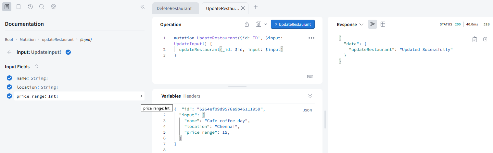

# graphql-CRUD-project

Backend With Graphql(Apollo-server), MongoDB(mongoose)

### Screenshot

### CREATE RESTAURANTS ###

### GET ALL RESTAURANTS ###

### UPDATE RESTAURANTS ###

### DELETE RESTAURANTS ###

